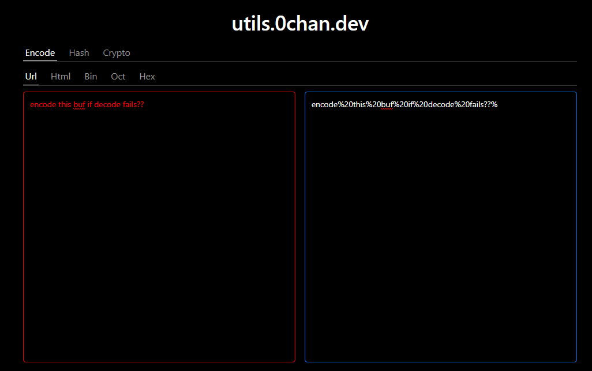

# utils

[utils.0chan.dev](https://utils.0chan.dev)

semantic ui에 이은 두번째 ui 프레임워크 [geist](https://github.com/geist-org/react) 써보는 간단한 프로젝트

이런 사이트를 어디서 본 거 같은데 찾으려 하면 없고 검색하면 나오는 사이트는 다 구리고 흩어져있어서 그냥 만들기

일단 나만 쓸 것 같지만 기능 요청받으면 추가할듯

- [ ] encode
  - [x] url
  - [ ] html
  - [ ] bin
  - [ ] oct
  - [ ] hex
- [ ] hash
  - [ ] md5
  - [ ] sha256
  - [ ] sha512
- [ ] crypto
- [ ] unicode?
